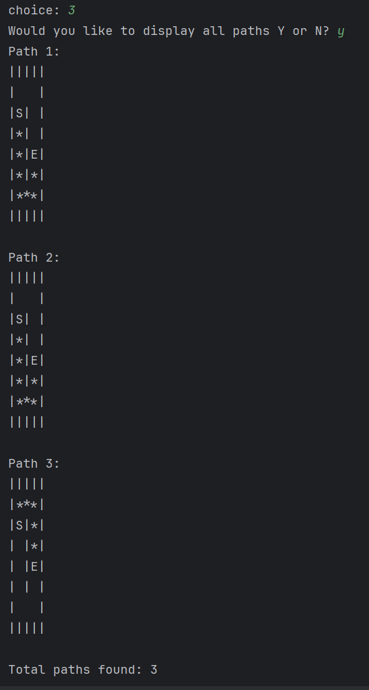
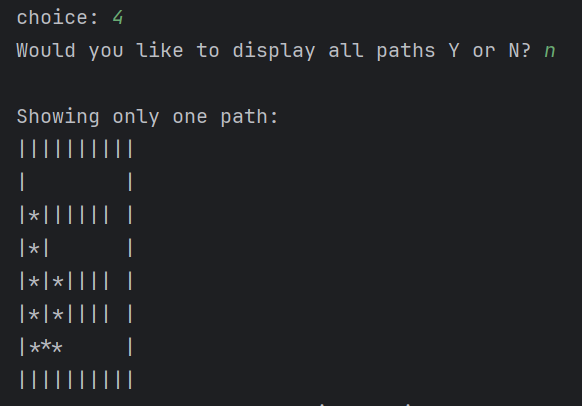

# Maze Project
#### Jean Carlos Guzman Student#: 2495044

## Big O analysis
The ```walkAllPaths() ``` function has exponential complexity of O(4^n*m) where n and m represent the width and height of the maze. All paths will be explored.
The ```walk() ``` complexity of O(4^min(n×m,P) where P represents the length of the path. Even though the function may explore a big chunk of the maze, it will stop once the end is reached.


## code
### Main.java
```java
import java.util.ArrayList;
import java.util.List;
import java.util.Scanner;

public class Main {

    static List<Point> path = new ArrayList<>();
    static List<List<Point>> allPaths = new ArrayList<>();
    static int[][] directions = {{1, 0}, {-1, 0}, {0, 1}, {0, -1}};


    public static void main(String[] args) {
        String str;
        Scanner input = new Scanner(System.in);

        while (true) {
            System.out.println("=========== Maze Exploration Project===========");
            System.out.print("Please select a maze or press x to exit... \n");
            System.out.println("""
                    1. No path maze
                    2. One path
                    3. Two Paths
                    4. Five Paths
                    5. Most Paths?
                    6. File""");
            System.out.print("choice: ");

            str = input.next().toLowerCase();

            //Exit Condition
            if (str.equals("x")) {
                break;
            }
            //maze selection
            int choice;

            //Validate inputs
            try {
                choice = Integer.parseInt(str);
                if (choice < 1 || choice > 6) {
                    throw new NumberFormatException();
                }
            } catch (NumberFormatException e) {
                System.out.println("Invalid choice. Please select a number between 1 and 6.");
                continue;
            }

            char[][] maze = selectAmaze(choice);

            System.out.print("Would you like to display all paths Y or N? ");

            str = input.next().toLowerCase();

            switch (str) {
                case "y":
                    solve(true, maze, '|');
                    displayPaths(maze, allPaths);
                    System.out.println("Total paths found: " + allPaths.size() + "\n");
                    break;

                case "n":
                    maze = selectAmaze(choice);
                    solve(false, maze, '|');

                    if (path.isEmpty()) {
                        System.out.println("There are no paths");
                    } else {
                        System.out.println("\nShowing only one path: ");
                        for (Point p : path) {
                            if (maze[p.x][p.y] != 'S' || maze[p.x][p.y] != 'E') {
                                maze[p.x][p.y] = '*';
                            }
                        }
                        for (char[] row : maze) {
                            System.out.println(new String(row));
                        }
                    }
                    break;

                default:
                    System.out.println("Not a valid choice" + "\n");
            }
        }
    }

    //this function is responsible for providing all working variables of the walk function
    //also it converts the Path stack into a list
    public static void solve(boolean walkAllPaths, char[][] maze, char wall) {
        List<Point> startAndEndCoordinates = findStartAndEndCoordinates(maze);
        boolean[][] seen = new boolean[maze.length][maze[0].length];

        if (walkAllPaths) {
            walkAllPaths(maze, wall, startAndEndCoordinates.get(0), startAndEndCoordinates.get(1), seen, path, allPaths);
        } else {
            walk(maze, wall, startAndEndCoordinates.get(0), startAndEndCoordinates.get(1), seen, path);
        }
    }

    //This function is in charge of visiting nodes, checking if nodes around are walls, visited nodes, or open path.
    //If the exit is found, the path will be added to the allPaths list.
    //complexity of O(4^n*m) where n and m represent the width and height of the maze. All paths will be explored.
    public static void walkAllPaths(char[][] maze,
                                    char wall,
                                    Point current,
                                    Point End,
                                    boolean[][] seen,
                                    List<Point> currentPath,
                                    List<List<Point>> allPaths
    ) {
        //Base Cases
        //1. Off the map
        if (current.x < 0 || current.x >= maze.length ||
                current.y < 0 || current.y >= maze[0].length) {
            return;
        }
        //2. It is a wall
        if (current.value == wall) {
            return;
        }

        //3. If already seen
        if (seen[current.x][current.y]) {
            return;
        }

        //Adding the position to be explored and marking it as seen
        currentPath.add(current);
        seen[current.x][current.y] = true;

        // Once the end is reached, add the path to the allPaths list
        if (current.x == End.x && current.y == End.y) {
            allPaths.add(new ArrayList<>(currentPath));
        } else {

            //Recursing
            for (int[] dir : directions) {
                Point newCurrent = new Point(current.x + dir[0], current.y + dir[1], maze[current.x + dir[0]][current.y + dir[1]]);
                walkAllPaths(maze, wall, newCurrent, End, seen, currentPath, allPaths);
            }
        }
        //backtrack to continue the search in adjacent directions.
        currentPath.removeLast();
        seen[current.x][current.y] = false;
    }

    //Walk only one path
    //complexity of O(4^min(n×m,P)
    // where n and m represent the width and height of the maze and P represents the length of the path
    //constrained by the smallest variable
    public static boolean walk(char[][] maze,
                               char wall,
                               Point current,
                               Point End,
                               boolean[][] seen,
                               List<Point> path
    ) {
        //Base Cases
        //1. Off the map
        if (current.x < 0 || current.x >= maze.length ||
                current.y < 0 || current.y >= maze[0].length) {
            return false;
        }
        //2. It is a wall
        if (current.value == wall) {
            return false;
        }
        //3. It is the end
        if (current.x == End.x && current.y == End.y) {
            path.add(current);
            return true;
        }
        //4. If already seen
        if (seen[current.x][current.y]) {
            return false;
        }

        //Pre
        seen[current.x][current.y] = true;
        path.add(current);

        //Recurse
        for (int[] dir : directions) {
            Point newCurrent = new Point(current.x + dir[0], current.y + dir[1], maze[current.x + dir[0]][current.y + dir[1]]);
            if (walk(maze, wall, newCurrent, End, seen, path)) {
                return true;
            }
        }
        //Post
        path.removeLast();
        return false;
    }


    // Find S and E inside the map.
    public static List<Point> findStartAndEndCoordinates(char[][] maze) {
        List<Point> SandE = new ArrayList<>();
        for (int i = 0; i < maze.length; i++) {
            for (int j = 0; j < maze[i].length; j++) {
                if (maze[i][j] == 'S') {
                    SandE.addFirst(new Point(i, j, maze[i][j]));
                }
                if (maze[i][j] == 'E') {
                    SandE.add(1, new Point(i, j, maze[i][j]));
                }
            }
        }
        return SandE;
    }

    //For testing only, choose from different mazes.
    public static char[][] selectAmaze(int choice) {
        char[][] maze = new char[0][0];

        switch (choice) {
            case 1 -> maze = new char[][]
                    {
                            {'|', '|', '|', '|', '|',},
                            {'|', ' ', '|', ' ', '|',},
                            {'|', 'S', '|', ' ', '|',},
                            {'|', ' ', '|', '|', '|',},
                            {'|', '|', '|', 'E', '|',},
                            {'|', ' ', '|', ' ', '|',},
                            {'|', ' ', '|', ' ', '|',},
                            {'|', '|', '|', '|', '|',}
                    };
            case 2 -> maze = new char[][]
                    {
                            {'|', '|', '|', '|', '|',},
                            {'|', ' ', '|', ' ', '|',},
                            {'|', 'S', '|', ' ', '|',},
                            {'|', ' ', '|', '|', '|',},
                            {'|', ' ', '|', 'E', '|',},
                            {'|', ' ', '|', ' ', '|',},
                            {'|', ' ', ' ', ' ', '|',},
                            {'|', '|', '|', '|', '|',}
                    };
            case 3 -> maze = new char[][]
                    {
                            {'|', '|', '|', '|', '|',},
                            {'|', ' ', ' ', ' ', '|',},
                            {'|', 'S', '|', ' ', '|',},
                            {'|', ' ', '|', ' ', '|',},
                            {'|', ' ', '|', 'E', '|',},
                            {'|', ' ', '|', ' ', '|',},
                            {'|', ' ', ' ', ' ', '|',},
                            {'|', '|', '|', '|', '|',}
                    };
            case 4 -> maze = new char[][]
                    {
                            {'|', '|', '|', '|', '|', '|', '|', '|', '|', '|',},
                            {'|', ' ', ' ', ' ', ' ', ' ', ' ', ' ', ' ', '|',},
                            {'|', 'S', '|', '|', '|', '|', '|', '|', ' ', '|',},
                            {'|', ' ', '|', ' ', ' ', ' ', ' ', ' ', ' ', '|',},
                            {'|', ' ', '|', 'E', '|', '|', '|', '|', ' ', '|',},
                            {'|', ' ', '|', ' ', '|', '|', '|', '|', ' ', '|',},
                            {'|', ' ', ' ', ' ', ' ', ' ', ' ', ' ', ' ', '|',},
                            {'|', '|', '|', '|', '|', '|', '|', '|', '|', '|',}
                    };
            case 5 -> maze = new char[][]
                    {
                            {'|', '|', '|', '|', '|', '|', '|', '|', '|', '|', '|', '|', '|', '|'},
                            {'|', 'S', ' ', ' ', ' ', ' ', ' ', ' ', ' ', ' ', '|', '|', '|', '|'},
                            {'|', ' ', '|', '|', '|', '|', '|', '|', '|', ' ', '|', '|', '|', '|'},
                            {'|', ' ', '|', '|', '|', '|', '|', '|', '|', ' ', '|', '|', '|', '|'},
                            {'|', ' ', '|', '|', '|', '|', '|', '|', '|', ' ', ' ', ' ', ' ', '|'},
                            {'|', ' ', ' ', ' ', ' ', ' ', ' ', ' ', ' ', '|', '|', '|', ' ', '|'},
                            {'|', '|', '|', '|', '|', '|', '|', '|', ' ', '|', '|', '|', ' ', '|'},
                            {'|', ' ', ' ', ' ', ' ', ' ', ' ', ' ', ' ', ' ', ' ', ' ', ' ', '|'},
                            {'|', '|', '|', '|', '|', '|', '|', ' ', '|', '|', '|', '|', ' ', '|'},
                            {'|', ' ', ' ', ' ', ' ', ' ', '|', ' ', ' ', ' ', ' ', ' ', ' ', '|'},
                            {'|', '|', '|', '|', '|', '|', '|', ' ', '|', '|', '|', '|', ' ', '|'},
                            {'|', '|', '|', '|', '|', '|', '|', ' ', ' ', ' ', ' ', ' ', ' ', '|'},
                            {'|', '|', '|', '|', '|', '|', '|', '|', '|', '|', '|', '|', 'E', '|'}
                    };
            case 6 -> maze = FileReader.readFile("maze");
        }
        return maze;
    }

    //Displaying all paths in the terminal
    public static void displayPaths(char[][] maze, List<List<Point>> paths) {
        for (int i = 0; i < paths.size(); i++) {
            char[][] mazeCopy = new char[maze.length][maze[0].length];
            for (int j = 0; j < maze.length; j++) {
                mazeCopy[j] = maze[j].clone();
            }

            for (Point p : paths.get(i)) {
                if (mazeCopy[p.x][p.y] != 'S' && mazeCopy[p.x][p.y] != 'E') {
                    mazeCopy[p.x][p.y] = '*';
                }
            }

            System.out.println("Path " + (i + 1) + ":");
            for (char[] row : mazeCopy) {
                System.out.println(new String(row));
            }
            System.out.println();
        }
    }
}


```

## FileReader.java
```java
import java.io.File;
import java.io.FileNotFoundException;
import java.util.ArrayList;
import java.util.List;
import java.util.Scanner;

class FileReader {

    public static char[][] readFile(String path) {
        List<String> list = new ArrayList<>();

        try{

            File txtfile = new File(path);
            Scanner reader = new Scanner(txtfile);
            while(reader.hasNextLine()){
                String line = reader.nextLine();
                list.add(line);
            }
            reader.close();
        }

        catch (FileNotFoundException e){
            System.err.println("File not found");
        }

        return list.stream().map(String::toCharArray).toArray(char[][]::new);
    }

}

```
## Example maze inside the text file.
```
S||||||||||||||||||||||||||||||
               |              |
||||||||||  |  ||||  |  |||||||
|           |  |     |  |     |
||||  |  ||||  |  |  |||||||  |
|     |     |  |  |     |     |
|  ||||  ||||||||||  |||||||  |
|  |           |        |     |
|  ||||  |||||||  |||||||  |  |
|     |  |  |              |  |
|  |  |  |  |  ||||||||||||||||
|  |  |     |     |     |     |
|  ||||  ||||  ||||  |  |  ||||
|  |              |  |     |  |
||||  |  ||||||||||  |||||||  |
|     |     | ||              |
|  ||||  |  | |||||  ||||  ||||
|     |  |  | ||| |     |     |
|  |  ||||  | ||| ||||  |  ||||
|  |  |                 |     E
|||||||||||||||||||||||||||||||
```
## Screenshots







```
choice: 5
Would you like to display all paths Y or N? y
Path 1:
||||||||||||||
|S        ||||
|*||||||| ||||
|*||||||| ||||
|*|*|||||    |
|* *     ||| |
|***|||| ||| |
|            |
||||||| |||| |
|     |      |
||||||| |||| |
|||||||      |
||||||||||||E|

Path 2:
||||||||||||||
|S        ||||
|*||||||| ||||
|*||||||| ||||
|*|*|||||    |
|* *     ||| |
|***|||| ||| |
|            |
||||||| |||| |
|     |      |
||||||| |||| |
|||||||      |
||||||||||||E|

Path 3:
||||||||||||||
|S**      ||||
|*|*||||| ||||
| |*||||| ||||
| |*|||||    |
|        ||| |
|||||||| ||| |
|            |
||||||| |||| |
|     |      |
||||||| |||| |
|||||||      |
||||||||||||E|

Path 4:
||||||||||||||
|S        ||||
|*||||||| ||||
|*||||||| ||||
|*|*|||||    |
|********||| |
|***||||*||| |
|       *****|
||||||| ||||*|
|     |     *|
||||||| ||||*|
|||||||     *|
||||||||||||E|

Path 5:
||||||||||||||
|S        ||||
|*||||||| ||||
|*||||||| ||||
|*|*|||||    |
|********||| |
|***||||*||| |
|       *****|
||||||| ||||*|
|     |******|
|||||||*|||| |
|||||||******|
||||||||||||E|

Path 6:
||||||||||||||
|S        ||||
|*||||||| ||||
|*||||||| ||||
|*|*|||||    |
|********||| |
|***||||*||| |
|      **    |
|||||||*|||| |
|     |*     |
|||||||*|||| |
|||||||******|
||||||||||||E|

Path 7:
||||||||||||||
|S        ||||
|*||||||| ||||
|*||||||| ||||
|*|*|||||    |
|********||| |
|***||||*||| |
|      **    |
|||||||*|||| |
|     |******|
||||||| ||||*|
|||||||     *|
||||||||||||E|

Path 8:
||||||||||||||
|S********||||
|*|||||||*||||
|*|||||||*||||
|*|*|||||****|
|* *     |||*|
|***|||| |||*|
|           *|
||||||| ||||*|
|     |     *|
||||||| ||||*|
|||||||     *|
||||||||||||E|

Path 9:
||||||||||||||
|S********||||
|*|||||||*||||
|*|||||||*||||
|*|*|||||****|
|* *     |||*|
|***|||| |||*|
|           *|
||||||| ||||*|
|     |******|
|||||||*|||| |
|||||||******|
||||||||||||E|

Path 10:
||||||||||||||
|S********||||
|*|||||||*||||
|*|||||||*||||
|*|*|||||****|
|* *     |||*|
|***|||| |||*|
|      ******|
|||||||*|||| |
|     |*     |
|||||||*|||| |
|||||||******|
||||||||||||E|

Path 11:
||||||||||||||
|S********||||
|*|||||||*||||
|*|||||||*||||
|*|*|||||****|
|* *     |||*|
|***|||| |||*|
|      ******|
|||||||*|||| |
|     |******|
||||||| ||||*|
|||||||     *|
||||||||||||E|

Total paths found: 11

```